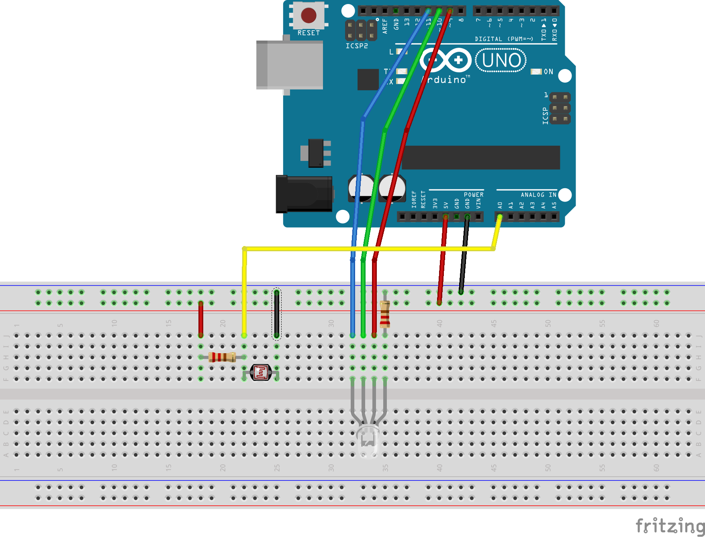

## Required components

* arduino
* 5mm RGB common cathode LED x1
* 330 ohm resistor (orange-orange-brown) x1
* 10k Ohm Resistor (brown-black-orange) x1
* Photo resistor x1
* jumper wires x8

## Setup

## Steps

* `git clone https://github.com/denvereezy/eXrobots.git`
* `cd eXrobots/color`
* `node app.js`
* Open your Browser and go to `http://localhost:8060`
