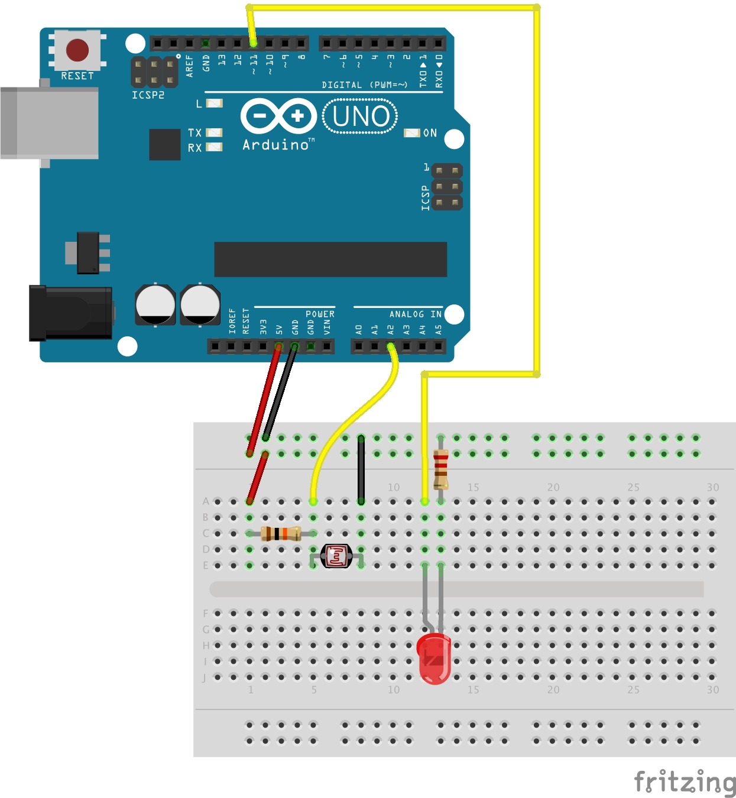

# Getting started
* If not already installed, install [node](https://www.digitalocean.com/community/tutorials/how-to-install-node-js-on-ubuntu-16-04).
* Clone this repo and change directory to it in the terminal: `~ $ cd eXrobots/ldr`.
* Now do `npm install`. This will install all modules used.

# Starting the app
* Run `node app.js`.

# Setting up hardware
 
