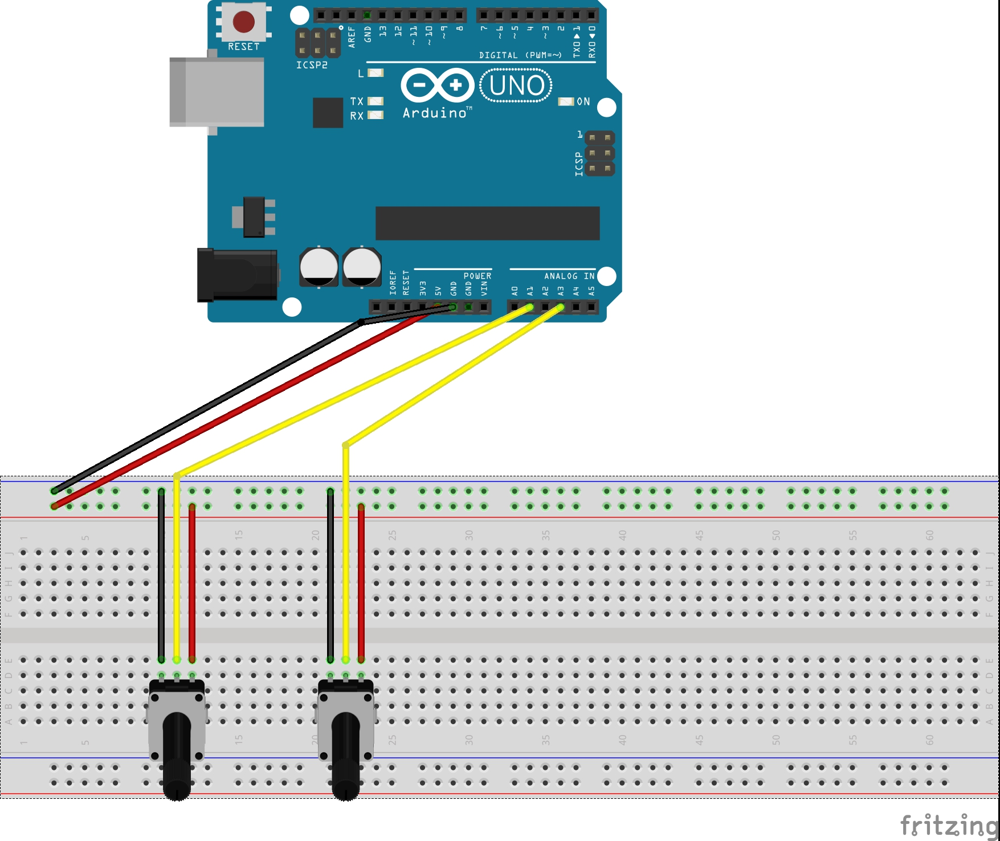

# Potentiometer
This app lets you use potentiometers to resize and move an image using css.

## Getting started
### Installing software
* Make sure that you are in this folder in the command line.
* Do a `npm install`. This will install all modules needed.

### Setting up hardware

## Running the app
* In the terminal type `node potentiometer.js` or `nodemon potentiometer.js`.
* You should see a message: `App running on port 8060`.
* In the browser type: `http://localhost:8060`.
